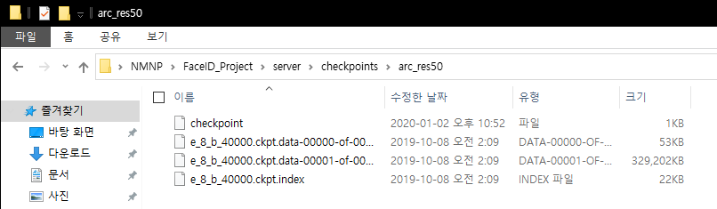

# Server
동작 방식  
flask web 서버를 통해 얼굴 사진을 전송받음 -> arcface 로 벡터화 -> DB 저장  

# requirement
## checkpoints  
미리 체크포인트를 받아둬야 에러가 발생하지 않습니다    
https://drive.google.com/file/d/1kRdFCCLjWh5rZkVlc5OENALUdFDDU74-/view?usp=sharing  
위 파일을 받아서 server 폴더 안에 checkpoints 라는 폴더를 만들고 파일의 압축을 풀어주세요.  
그래야 [*] Cannot find ckpt from None. 라는 에러가 발생하지 않습니다.

## dependencies
* python 3.7 or 이상
* tensorflow 2.1 이상
* opencv-python 4.1 이상
* bcolz 1.2 이상
* sklearn2
* PyYAML
* tqdm

# 기능 구현
* [v]사진 촬영 기능 -> client 폴더안 client.py 의 capture_face_img 함수  
    카메라로 촬영중인 화면이 스크린에 나오고 c 를 누르면 촬영 되도록 한다
* [v]얼굴 디텍트 기능 -> util 폴더안 faceCapture.py 의 find_face 함수  
    촬영된 사진에 어디에 얼굴이 있는지 검출한다
* [v]얼굴 alignment 기능 -> util 폴더안 faceCapture.py 의 align_face 함수  
    얼굴 사진을 기울지 않게 수평으로 만들어 뽑아낸다 {'success':False, 'faceImg':None} 와 같이 성공여부도 같이 반환한다  
* [v]얼굴 벡터화 기능 -> arcface_tf2폴더안 vectorized_face_image.py 의 get_vect_face_img 함수  
    얼굴 사진을 벡터(1, 512)화 한다
* 데이터베이스 CRUD 기능  
    db 에 값 생성, 조회, 업데이트, 삭제 기능 생성
* [v]flask 서버 기능 -> server.py  
    [v]사진 을 전송받는 기능  
    관리자 페이지 접속

* 여려곳에서 공통적으로 쓰이는 함수들 util 폴더에 따로 빼두기

# 서버실행
py server.py